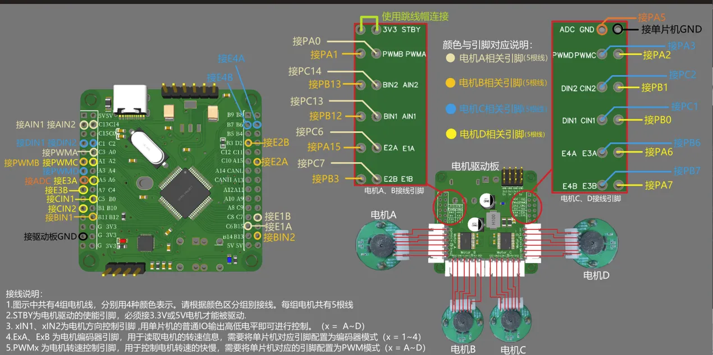
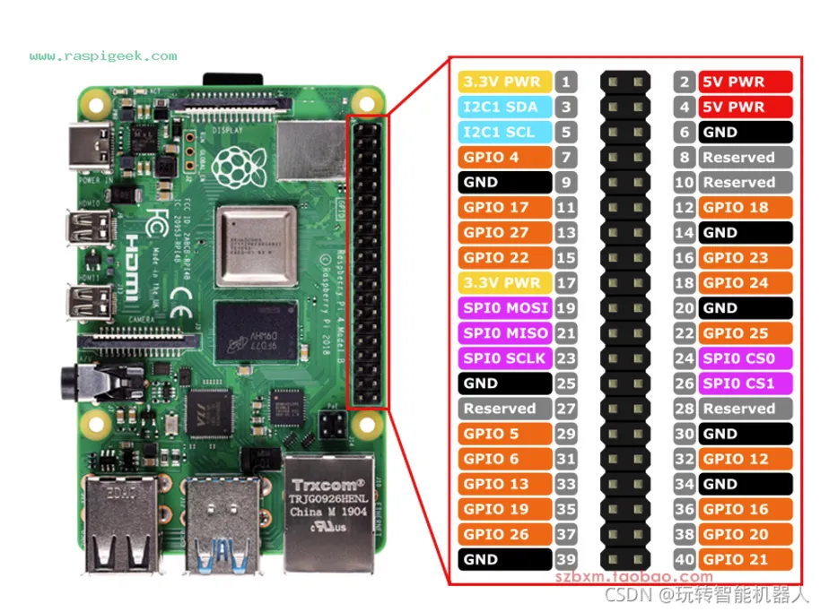

# 3DGS Real-World Dynamic Implementation Framework

A lightweight, real-time rendering system running on a Raspberry Pi–powered mobile robot. It uses a Intel RealSense D435i camera to capture live 3D data and employs the 3D GS Splatting algorithm for efficient reconstruction and rendering. Key features include:

- **Real-Time Performance**  
  Smooth point‑cloud interpolation and lighting calculations on a resource‑constrained Raspberry Pi platform.  

- **Dynamic Adaptation**  
  Continuously collects new data as the robot moves and updates the scene on the fly.  

- **Lightweight Deployment**  
  Modular design with minimal computing and storage requirements, allowing fast startup and shutdown on edge devices.  

- **High-Quality Rendering**  
  Utilizes the 3D GS Splatting algorithm to produce smooth splat‑based voxel rendering with natural light and shadow transitions for enhanced visual fidelity.  

This framework is ideal for mobile robotics vision, field surveying, augmented reality, and other scenarios where efficient 3D environment perception and visualization on edge devices are required.  

---
Note: The source code for the core 3D GS Splatting implementation is currently proprietary and not publicly available. It will be open-sourced in the future—stay tuned for updates!

---
## Author

- **Name:** Jincheng Pan  
- **Email:** jincpan@gmail.com  

---

# Instruction File


## 1. Prerequisites

Your machines should meet the following software requirements:

| Software             | Version                           |
| -------------------- | ----------------------------------|
| **OS (Raspberry Pi)**| Raspberry Pi 5(Ubuntu 24.04 LTS)  |
| **OS (PC)**          | Ubuntu 24.04 LTS                  |
| **ROS 2**            | Jazzy & Humble                    |
| **Docker**           | Ubuntu 22.04 LTS                  |

---

## 2. Hardware Overview

| Component      | Model / Specs                       | Notes                                         |
| -------------- | ----------------------------------- | --------------------------------------------- |
| **Raspberry Pi**  | Raspberry Pi 5<br>8 GB RAM         | Onboard Wi‑Fi & Gigabit Ethernet              |sss
| **Camera**        | Pyrealsense D435i      |                           |
| **Motor Driver**  | TB6612(D24A)                         | PWM control             |
| **Wheels**        | Mecanum wheels, 55 mm diameter   | Allows omnidirectional movement            |
| **IMU Module**      | 9‑DoF IMU        | Provides accelerometer, gyroscope & magnetometer readings  |
| **Xbox Controller** | Xbox Wireless Controller          | Connect via USB dongle |
---
### 2.1 Wiring Diagrams

#### Motor Driver Connection



*Figure 1: Motor driver control board ↔ Raspberry Pi GPIO wiring.*

---

#### Raspberry Pi Pinout



*Figure 2: Raspberry Pi 40‑pin header pinout.*

---
Below is the mapping of signals for motors A, B, C, and D to the Raspberry Pi GPIO pins. Each motor has five connections in this order:
1. **PWM** (speed control)  
2. **DIR1** (direction control 1)  
3. **DIR2** (direction control 2)  
4. **ENC A** (encoder channel A)  
5. **ENC B** (encoder channel B)  

| Motor | Signal             | Driver Header Pin | Raspberry Pi GPIO |
| :---- | :----------------- | :---------------- | :---------------: |
| **A** | PWMA (PA0)         | PWMA              | GPIO18            |
|       | AIN1               | AIN1              | GPIO14            |
|       | AIN2               | AIN2              | GPIO15            |
|       | E1A (Encoder A)    | E1A               | GPIO23            |
|       | E1B (Encoder B)    | E1B               | GPIO24            |
| **B** | PWMB (PA1)         | PWMB              | GPIO12            |
|       | BIN1               | BIN1              | GPIO1             |
|       | BIN2               | BIN2              | GPIO27            |
|       | E2A (Encoder A)    | E2A               | GPIO25            |
|       | E2B (Encoder B)    | E2B               | GPIO17            |
| **C** | PWMC               | PWMC              | GPIO19            |
|       | CIN1               | CIN1              | GPIO16            |
|       | CIN2               | CIN2              | GPIO20            |
|       | E3A (Encoder A)    | E3A               | GPIO26            |
|       | E3B (Encoder B)    | E3B               | GPIO21            |
| **D** | PWMD               | PWMD              | GPIO13            |
|       | DIN1               | DIN1              | GPIO6             |
|       | DIN2               | DIN2              | GPIO5             |
|       | E4A (Encoder A)    | E4A               | GPIO0             |
|       | E4B (Encoder B)    | E4B               | GPIO11            |

---
### 2.2 Camera Calibration

The Pyrealsense D435i camera was calibrated with the following parameters:

- **Image resolution:** 640 × 480  
- **Depth scale:** 1000.0  

**Intrinsic parameters** (no distortion):

| Parameter   | Value    |
| ----------- | -------: |
| fx (focal x) | 608.046 |
| fy (focal y) | 607.629 |
| cx (principal point x) | 323.124 |
| cy (principal point y) | 251.270 |
| k₁ (radial) | 0.0     |
| k₂ (radial) | 0.0     |
| k₃ (radial) | 0.0     |
| p₁ (tangential) | 0.0  |
| p₂ (tangential) | 0.0  |
| **Distorted?** | **False** |

These parameters are used to project depth pixels into real-world coordinates and to undistort the RGB image before any computer-vision processing.  
---

## 3. Quick‑Start Commands

1. **Set ROS Domain**  
   Raspberry Pi and its Docker container already have `ROS_DOMAIN_ID` configured. On the PC, run:
   ```bash
   export ROS_DOMAIN_ID=10
   ```
2. **Bare‑metal on Raspberry Pi**  
   Launch the controller node directly on your Pi:
   ```bash
    cd ~/ros2_sa/
    ros2 launch controller combined_launch.launch.py
   ```
   Then, in a second terminal window (on the same Pi), run:
   ```bash 
    ros2 launch controller control_gamepad_mecanum.launch
   ```
3. **Inside Docker on Raspberry Pi**  
   Before running the node, start and enter your Docker container:

   ```bash
   # Start the container
   sudo docker start 2f4e56a849e0

   # Enter the container interactively
   sudo docker exec -it 2f4e56a849e0 /bin/bash
   ```
    Once inside the container, run:
   ```bash
    cd ~/ros2_sa/
    ros2 launch image_compress camera_image_compress.py
   ```
   `Note`:
    If you see warnings from the Pyrealsense Camera during runtime, simply rerun the launch command (ros2 launch ...). This is a known intermittent issue with the camera driver.
   `Note`: Rebuilding the container

    If you need to rebuild the container, you can use the Docker files located in the docker/ directory (or the docker/images/ subdirectory). Simply navigate there and run:
    ```bash
      cd docker/         # or docker/images/
      # Adjust the path and image name as needed to recreate or update your container.
      sudo docker build -t <image_name> ./ 
    ```
4. **On a PC**  
    Make sure you’ve built and sourced the workspace, then:
   ```bash
    cd ./ros2_sa/
    source install/setup.bash
    ros2 launch image_decompress image_decompress_node.py
   ```
## 4. Demo

Below is a showcase of the real-time 3D GS reconstruction results using this testing framework.  


> **Video:** [Watch the full demo](https://your.video.link)

---
## 5. SLAM & Nav2 Support

This repository also includes configuration examples for SLAM-based mapping (using SLAM Toolbox) and autonomous navigation (using Nav2). Install the corresponding packages and launch the provided SLAM and Nav2 configuration files for testing.